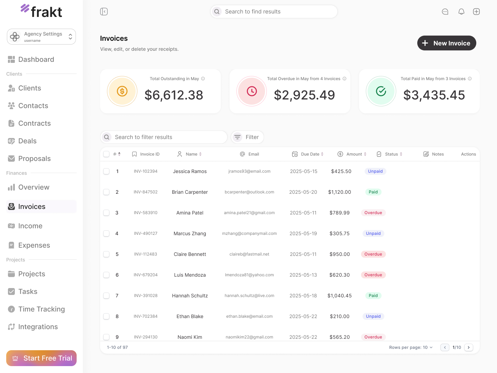
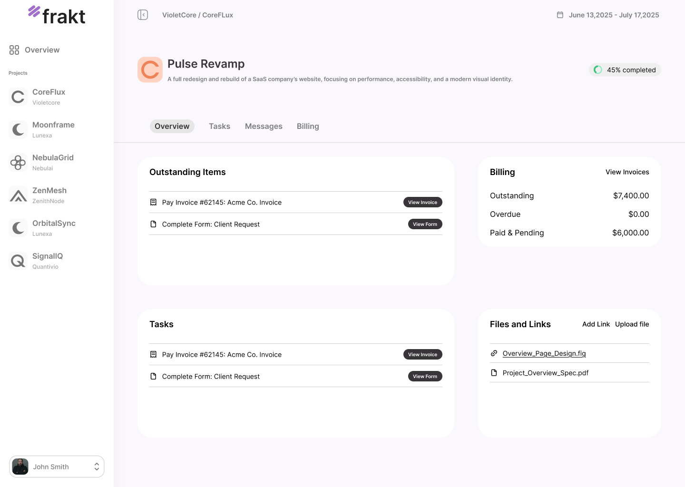

**Frakt** is a modern B2B SaaS dashboard that helps agencies and freelancers manage clients, projects, invoices, and payments — built specifically for freelancers and small agencies.

<table align="center">
  <tr>
    <td align="center" style="padding: 0 15px;">
      
      <div><small><b>Invoices Page</b></small></div>
    </td>
    <td align="center" style="padding: 0 15px;">
      
      <div><small><b>Client Portal</b></small></div>
    </td>
  </tr>
</table>

## ✅ Features (Admin Dashboard)

- [x] Navigation structure
- [ ] Invoices
  - [x] Invoice list view
  - [ ] Create new invoice
  - [ ] Edit invoice
  - [ ] Update miltiple invoices
  - [ ] Filter invoices
  - [ ] Sort invoices
  - [ ] Server side pagination
  - [ ] PDF export/download
- [ ] Payments
  - [ ] Payment tracking
  - [x] Integration with Stripe
- [ ] Profile and account settings

---

## 🧾 Client Portal

A simple portal where clients can view and pay invoices.

- [x] Invoices table
- [ ] "Pay Now" functionality
- [ ] View/download invoice PDFs
- [ ] Past payment history
- [ ] Project overview (optional for future)

## 📦 Getting Started

Follow these steps to set up **Frakt** locally:

### 1. Clone the repository

```bash
git clone https://github.com/bardiamdn/frakt.git
cd frakt
```

### 2. Install dependencies

```bash
npm install
```

### 3. Create and configure the `.env` file

Create a `.env` file in the root directory of the project:

```bash
cp .env.example .env
```

Then open `.env` in your editor and fill in the required values:

```env
# Supabase (Database & Auth)
NEXT_PUBLIC_SUPABASE_URL=your_supabase_url
NEXT_PUBLIC_SUPABASE_ANON_KEY=your_supabase_anon_key
SUPABASE_SERVICE_ROLE_KEY=your_supabase_service_role_key

# Stripe (Payments)
NEXT_PUBLIC_STRIPE_PUBLISHABLE_KEY=your_stripe_publishable_key
STRIPE_SECRET_KEY=your_stripe_secret_key
STRIPE_WEBHOOK_SECRET=your_stripe_webhook_secret

# App URL
NEXT_PUBLIC_SITE_URL=http://localhost:3000
```

> 💡 If you don’t have a Supabase project yet, create one at [https://supabase.com](https://supabase.com).  
> For Stripe keys, visit [https://dashboard.stripe.com](https://dashboard.stripe.com).

### 4. Start the development server

```bash
npm run dev
```

Visit [http://localhost:3000](http://localhost:3000) to view the dashboard in your browser.
